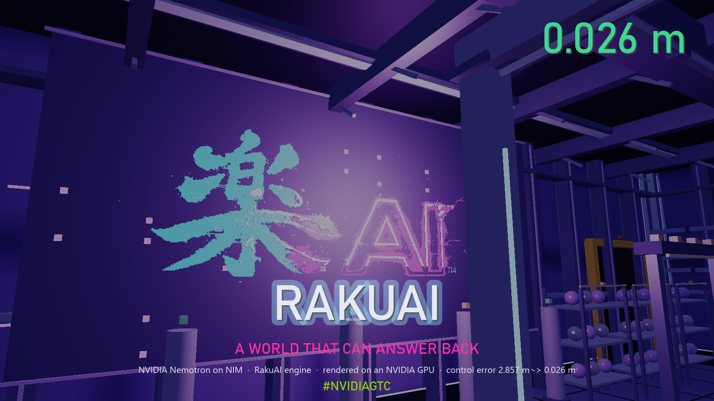
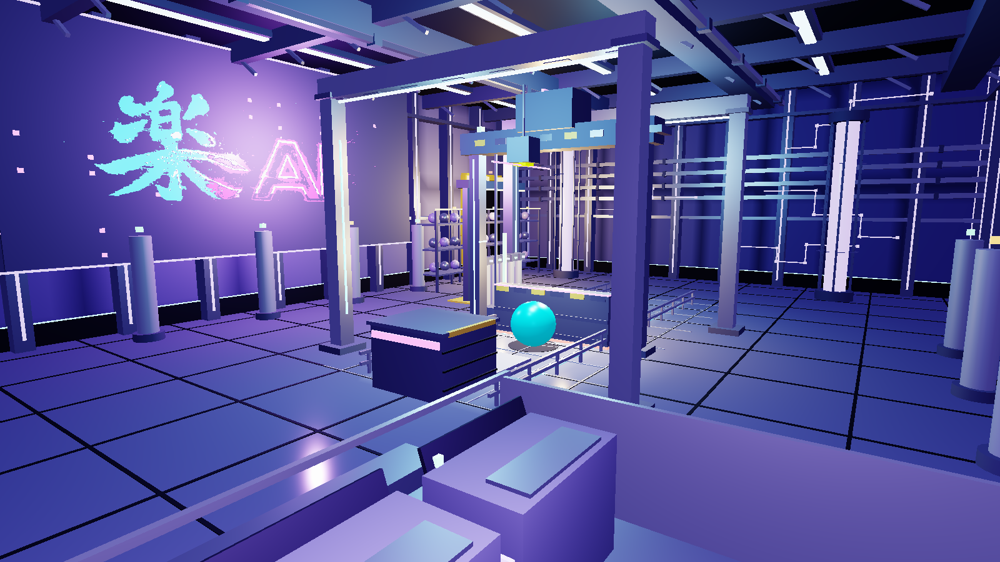

# RakuWorld

## The open NVIDIA GTC showcase for RakuAI

**RakuAI is the AI-Native Spatial Runtime — a compiled spatial engine designed
for AI agents to act in, measure, and control a world.**

RakuWorld is the open showcase.

> **2.857 m control error → 0.026 m**
>
> **~99.1% reduction in control error**
> *(derived from the published evidence)*
>
> Final result: **26 mm from a 3.000 m target, inside tolerance.**

**[▶ Watch the RakuAI / RakuWorld GTC film](video/rakuai-rakuworld-gtc.mp4)** · [direct video link](https://github.com/RakuXR/raku-world-public/raw/main/video/rakuai-rakuworld-gtc.mp4)

[](video/rakuai-rakuworld-gtc.mp4)

---

## Why NVIDIA

**NVIDIA Nemotron** drives the reasoning/control loop
(`nvidia/nemotron-3-nano-omni-30b-a3b-reasoning`).

**NVIDIA NIM** serves the model (`integrate.api.nvidia.com`).

**NVIDIA GPU rendering** renders the demonstrated spatial environment — the
adapter is read back from the created Direct3D 11 device (NVIDIA Quadro T2000).
Physics runs on the CPU; the GPU renders.

The loop is:

**agent acts → runtime measures → agent corrects**

The model states its prediction before the engine runs. The runtime measures
what actually happened and refuses a prediction restated afterwards. The agent
corrects from the measured error — iterative correction, nothing trained.

---

## RakuAI

**The AI-Native Spatial Runtime**

RakuAI is a C++ spatial runtime built to be driven by AI agents.

It brings spatial state, rendering, physics, audio, and related engine systems
behind agent-facing interfaces.

**The C++ Spatial Runtime an LLM Can Drive.**

**PREDICT · ACT · MEASURE · CORRECT**

https://rakuai.com



---

## MCP-native spatial AI

RakuAI exposes spatial capabilities through MCP so compatible AI agents can
operate against a common measurable world/runtime interface:
**agent → MCP → RakuAI → spatial world**, with the world's answer read back.

The MCP capability and the published closed-loop result are distinct verified
surfaces. The published 0.026 m result was measured in-process; it is not
described as an MCP-transport run.

---

## Public evidence

- [`proof/public-evidence.json`](proof/public-evidence.json) — the model and
  serving endpoint, the target and tolerance, the initial and final control
  error, the derived reduction, the within-tolerance result, the observed GPU
  rendering path, the hashes of the two showcase frames, the hash of the
  public film, and the SHA-256 binding to the private measurement record.
- [`proof/showcase-initial.png`](proof/showcase-initial.png) — the runtime's
  own render at the initial control error.
- [`proof/showcase-final.png`](proof/showcase-final.png) — the runtime's own
  render at the final control error.

The private measurement record itself (tool calls, intermediate measurements,
model reasoning) is not published; its SHA-256 is.

---

## Verify

```bash
python verify.py
python verify.py --selftest

python recheck_offline.py
python recheck_offline.py --selftest
```

`verify.py` re-hashes every published file listed in `SHA256SUMS`.
`recheck_offline.py` re-derives every published number from
`proof/public-evidence.json`. Both self-tests corrupt a temporary copy and prove
the check can fail. Standard library only, no network, no credential.

---

## Scope

This repository publishes the open showcase, selected evidence, and verification
tooling. See [`SCOPE.md`](SCOPE.md).

The proprietary RakuAI engine implementation and compiled runtime binaries are
not distributed here.

---

MIT licensed public showcase.
